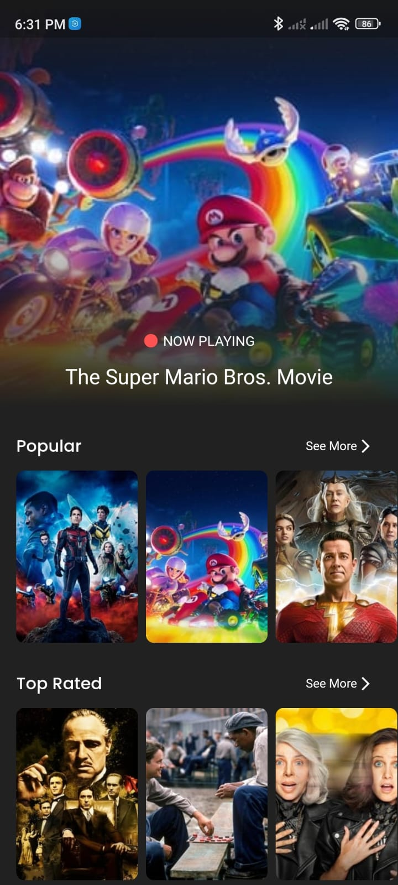
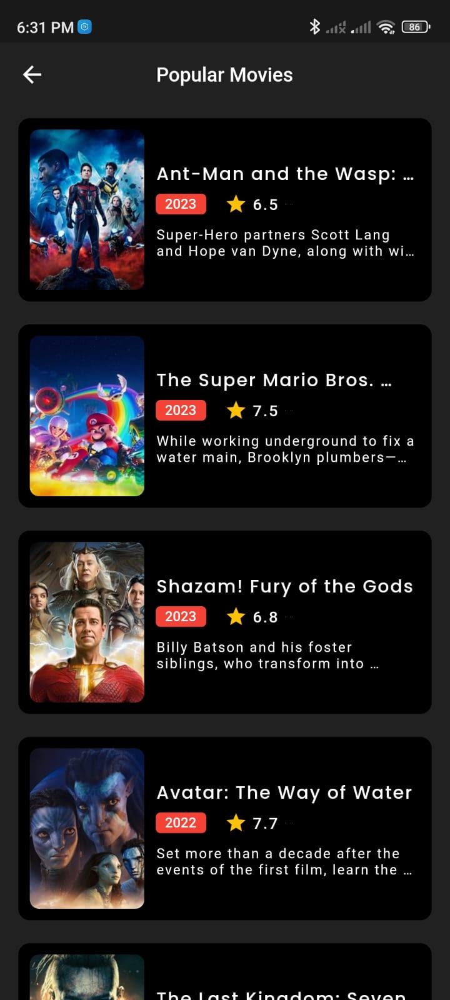
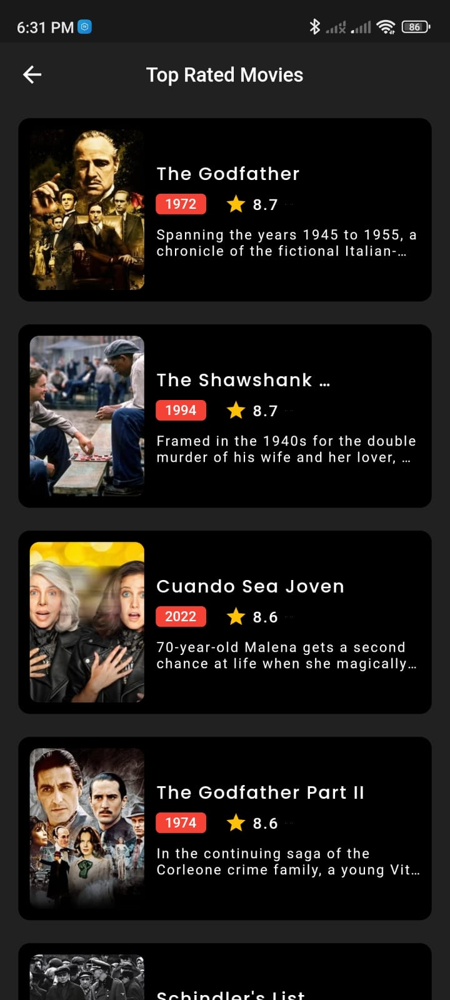
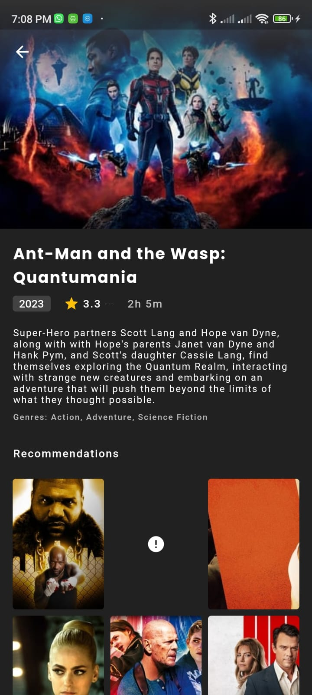
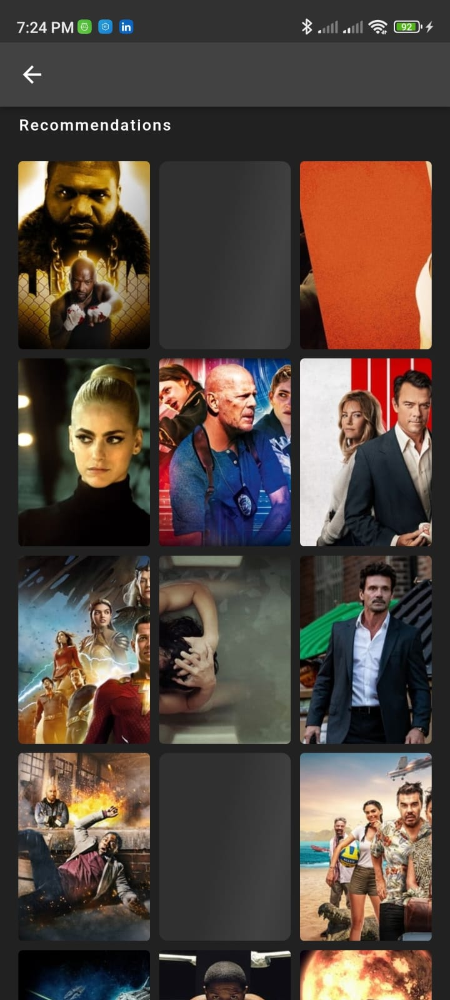
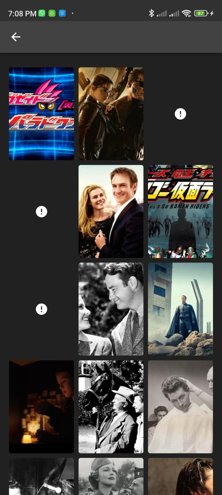

# Movies App

 It's a flutter app to help show's lovers find proper shows like anime and the film even their best serials ln this app,
1- I used : 
2- Clean Architecture- Bloc as State Management
3- Some useful packages Pattern as
4- ( get_it - carousel_slider - dartz - Equatable- Dio - animate_do - cached_network_image - google_font - shimmer )
5- and try making the code clean code as much as possible.

| Home Screen | Popular Screen                       |
|------|-------------------------------------------|
||  |
| Top Rated Screen  | Movie Details Screen                       |
|  |  |
| Recommendation Screen  | Similar Screen                       |
|  |  |
