# Movies App

 It's a Flutter App to help show's lovers find proper shows like anime and the film even their best serials ln this app,
- I used : 
- Clean Architecture- Bloc as State Management
- Some useful packages Pattern as
- ( get_it - carousel_slider - dartz - Equatable- Dio - animate_do - cached_network_image - google_font - shimmer )
- and try making the code clean code as much as possible.
## Download App 
<a href="https://github.com/HusseinMohamed99/Movies_App/releases/download/v2.0.0/Movies.apk"></img></a>

| Splash Screen | Movies Screen                       |
|------|-------------------------------------------|
|| 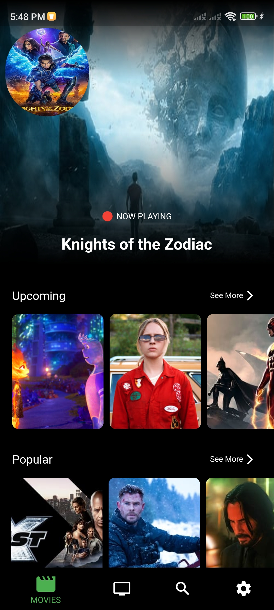 |
| UpComing Screen  | Popular Screen                       |
| 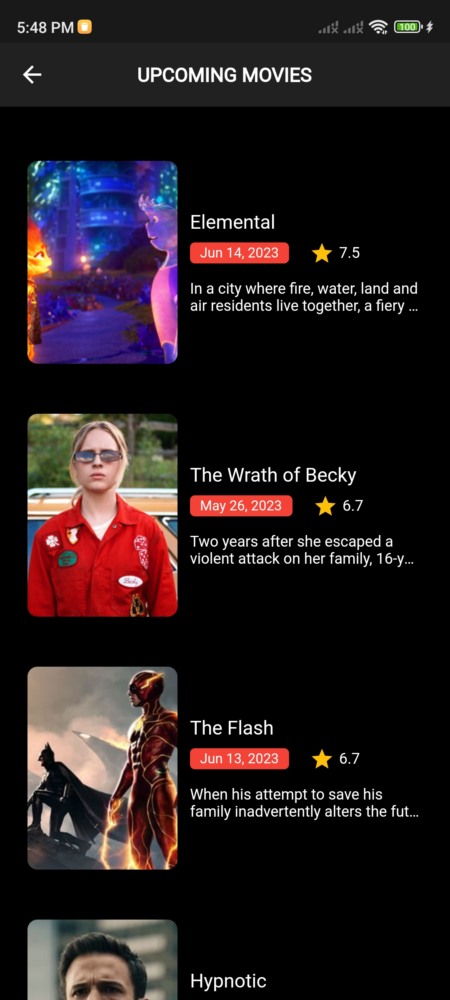 | 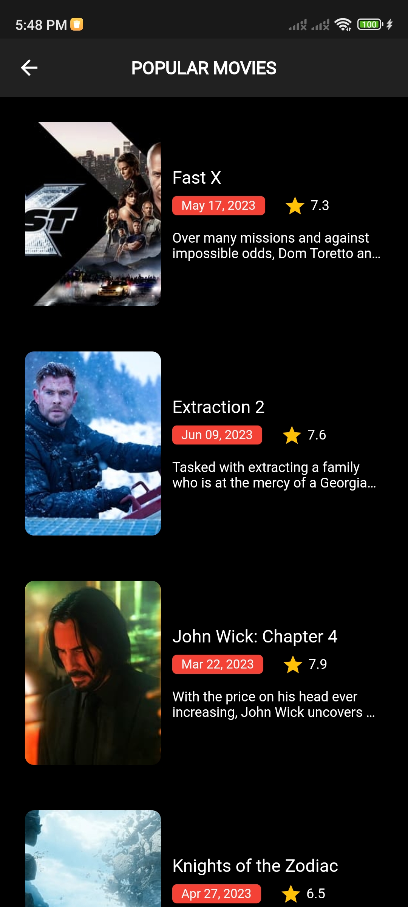 |
| Top Rated Screen  | Movies Details Screen                       |
| 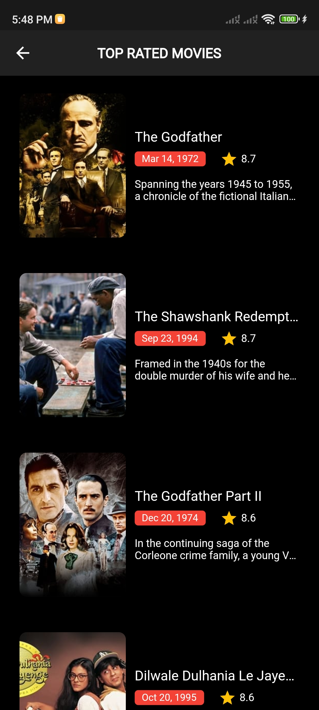 | 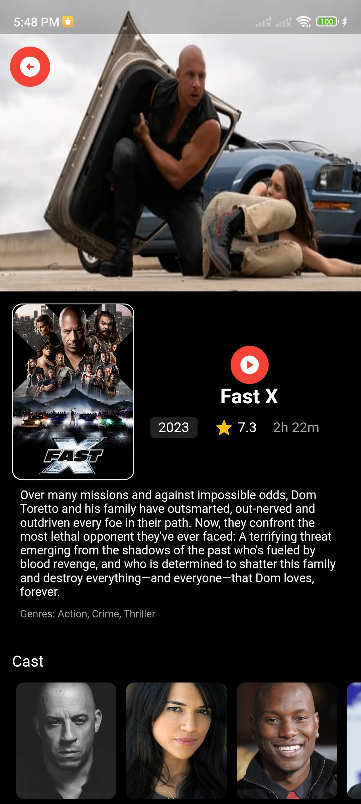 |
| Tvs Screen  | Airing Today Screen                       |
|  | 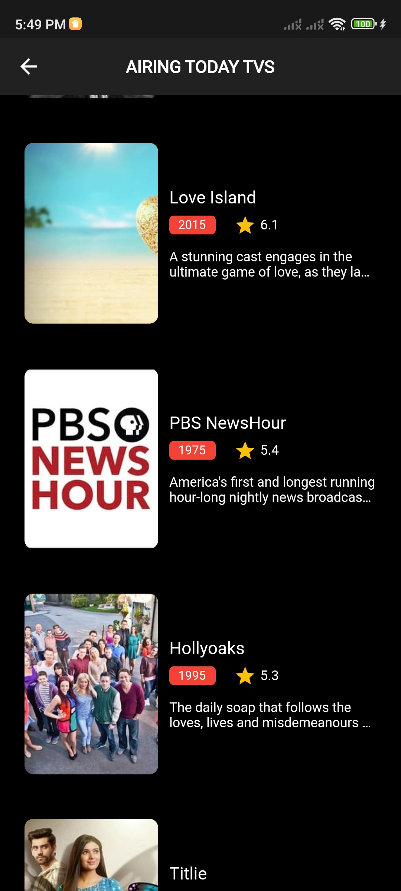 |
| Popular Screen  | Top Rated Screen                       |
| 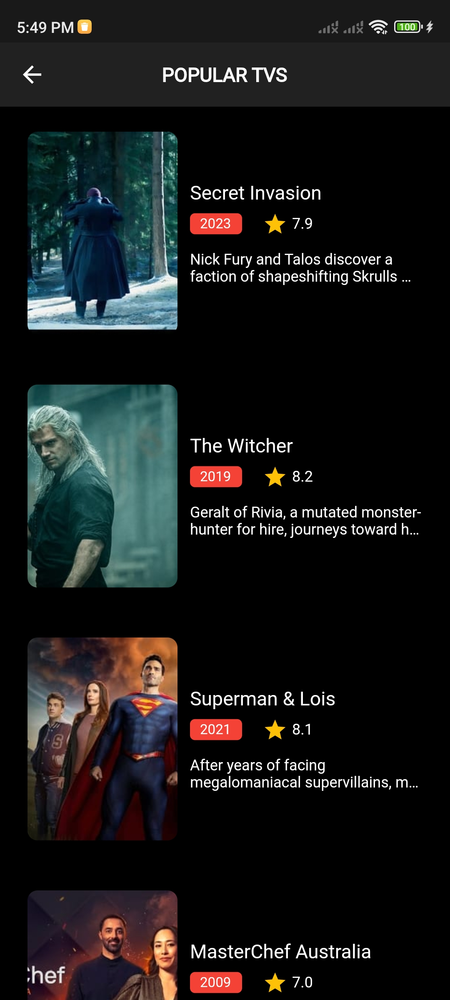 | 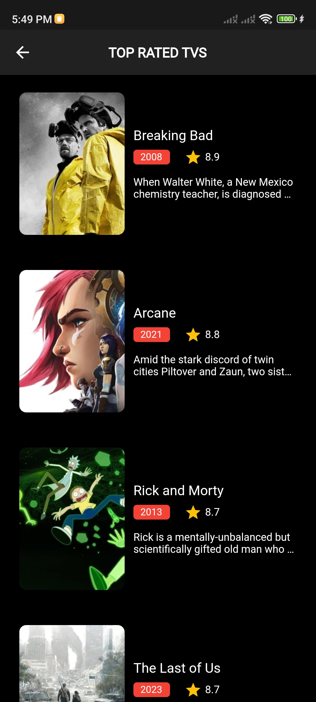 |
| Tvs Details Screen  | Recommendations Screen                       |
| 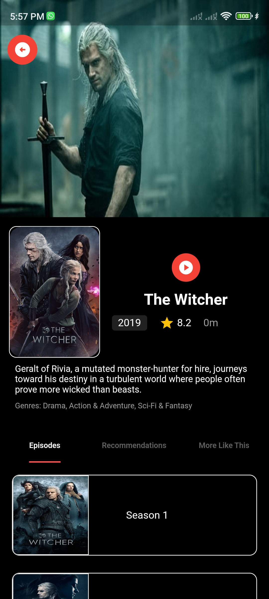 | 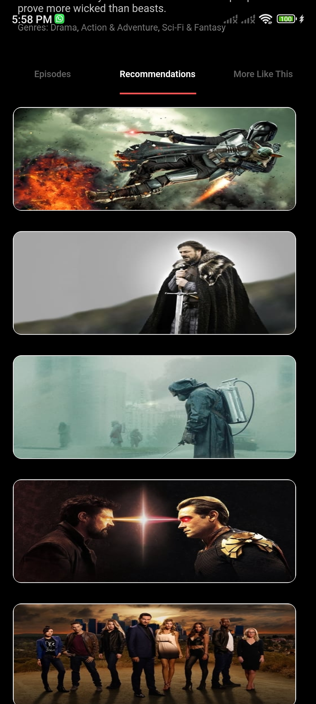 |
| Search Screen  | Setting Screen                       |
| 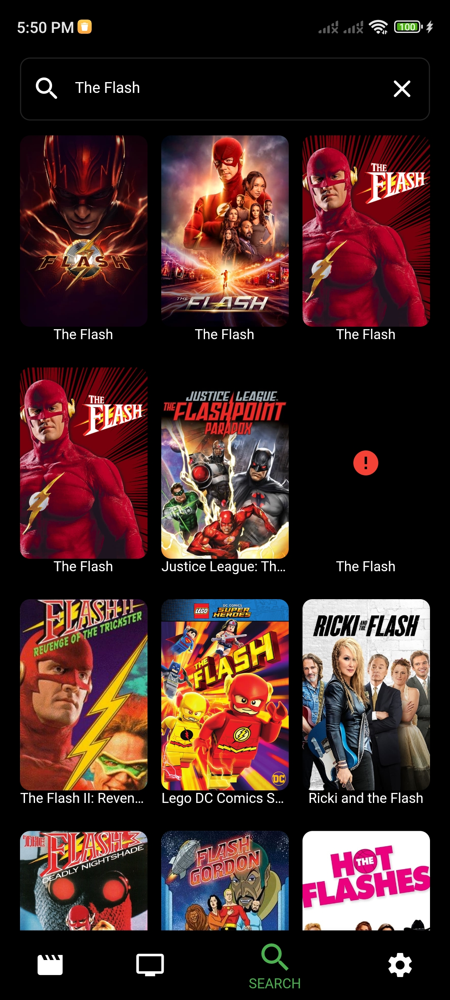 | 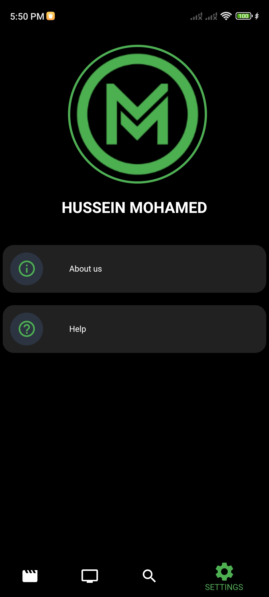 |
| About Us Screen  | Help Screen                       |
| 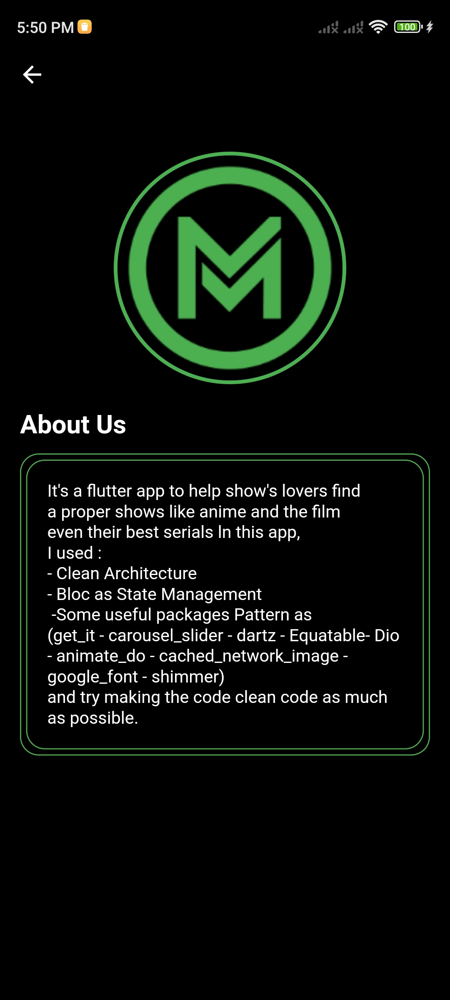 | 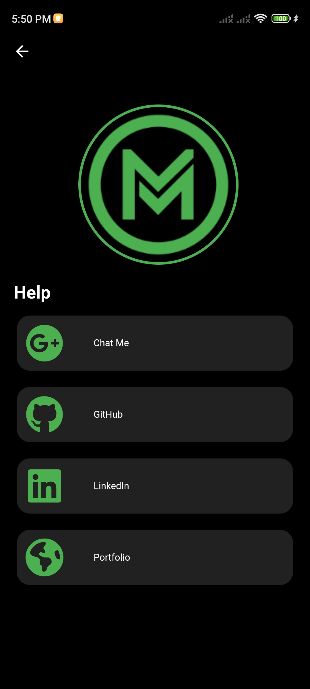 |
